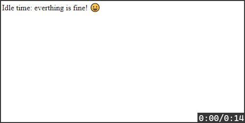

[](https://app.netlify.com/sites/polatengin-budapest/deploys)

[](https://github.com/polatengin/budapest/workflows/ci-and-cd)

# Determine idle time in WepApps

You can use the running version of this project at [https://polatengin-budapest.netlify.com/](https://polatengin-budapest.netlify.com/)

# What is idle timeout

_Idle time_ is duration the user is remaining inactive on the web page. During _idle time_, user does nothing on the web page, he/she may even away from the computer.

Many web apps, such as _banking_, _gaming_, etc. need to detect if the user is _idle_ to increase _performance_, _security_, etc.

For _high risky_ web apps, 2-3 minutes inactivity is risky, such as, finance apps, personal password vault apps, etc.

For _low risky_ web apps, sometimes 15-20 minutes inactivity is OK., such as, news apps, blog apps, etc.

Also, many web apps, need to have some calls to the backend or need to establish communication channels to backend, but when user is idle, it doesn't a requirement anymore. So, if the web app can detect the user is idle, then it can close communication channel and stop calling backend services to free-up resources on the backend side.

# How to detect if the user is idle

When user is on the page, he/she usually use peripherals to interact with the page, such as, _keyboard_, _mouse_, _touch screen_, etc.

It's possible to attach couple of [Events](https://developer.mozilla.org/en-US/docs/Web/API/Event) from [DOM API](https://developer.mozilla.org/en-US/docs/Web/API/Document_Object_Model) and reset the timer if one of them triggered. If nothing happened in the past _for example 20 seconds_, we can conclude that the user is _idle_.

Here is the few _events_ we can hook,

* [Mouse Events](https://developer.mozilla.org/en-US/docs/Web/API/MouseEvent)
* [Keyboard Events](https://developer.mozilla.org/en-US/docs/Web/API/KeyboardEvent)
* [Touch Events](https://developer.mozilla.org/en-US/docs/Web/API/TouchEvent)
* [Global Events](https://developer.mozilla.org/en-US/docs/Web/API/GlobalEventHandlers)

# Implementation

Start by creating _npm project_ with executing following command in your favorite _Terminal_ (my favorite is [Microsoft Terminal](https://github.com/microsoft/terminal) 😀)

```bash
npm init --force
```

It's possible to develop code in [Typescript](https://www.typescriptlang.org/) and _transpile_ the code to [Javascript](https://en.wikipedia.org/wiki/JavaScript) with [webpack](https://webpack.js.org/). In order to prepare the project for that, let's add couple of _DevDependencies_;

```bash
npm install typescript webpack webpack-cli --save-dev
```

Also, it'll be needed to serve project locally for debug purposes, let's add [http-server](https://www.npmjs.com/package/http-server) as a _DevDependency_;

```bash
npm install http-server --save-dev
```

Also, it'll be needed to pre-process _html_ and _typescript_ files with _webpack_, for example to _minify_ them. Let's add couple of more _DevDependencies_;

```bash
npm install clean-webpack-plugin copy-webpack-plugin html-minifier-webpack-plugin html-webpack-plugin ts-loader --save-dev
```

Finally, it'll be needed to _produce_ and _emit_ events to notify the page that user is inactive for certain amount of time, let's add [rxjs](https://rxjs.dev/) as a final dependency;

```bash
npm install rxjs
```

Now, we're ready to develop code.

> Since we're good software engineers, we ❤ reusable code.

Let's create [idle_timeout.src](./src/idle_timeout.ts) file in [src](./src/) folder.

First, we need a class definition;

```typescript
import { Observable, Observer } from 'rxjs';

export class IdleTimeOut {
}
```

Now, we need a mechanism to prevent developers to instantiate the class more than 1 time. We're going to handle this requirement by implementing [Singleton Design Pattern](https://www.dofactory.com/javascript/singleton-design-pattern);

```typescript
public static Current: IdleTimeOut = new IdleTimeOut();

private constructor() {
};
```

Now we need another mechanism to tap to few events;

```typescript
['mousedown', 'mousemove', 'keypress', 'scroll', 'touchstart', 'load'].forEach((event) => {
  document.addEventListener(event, this.Reset , true);
});
```

So, we can reset _idle timer_;

```typescript
public Reset = () => {
  this._tick_count = 0;
  if (this._observer) {
    this._observer.next(this._tick_count);
  }

  clearInterval(this._interval);
  this._interval = setInterval(() => { this._observer.next(++this._tick_count); }, 1000);
}
```

Finally, we only need to have an [Observable](http://reactivex.io/rxjs/class/es6/Observable.js~Observable.html) to alert outside-world about the progress of idle time;

```typescript
private _tick_count: number = 0;
private _interval: ReturnType<typeof setInterval>;

private _observer: Observer<number>;

public OnTick: Observable<number> = new Observable();

this.OnTick = Observable.create((observer: Observer<number>) => { this._observer = observer });
```

That's it for the [IdleTimeOut](./src/idle_timeout.ts) component, continue with creating [index.html](./src/index.html) file under [src](./src/) folder with following content;

```html
<!DOCTYPE html>
<html lang="en">
<head>
  <meta charset="UTF-8">
  <meta name="viewport" content="width=device-width, initial-scale=1.0">
  <title>Budapest - Detect if the user is idle</title>
</head>
<body>
  <span>Idle time: </span><span id="idle_time"></span>
</body>
</html>
```

Now, we can continue with creating [index.ts](./src/index.ts) file under [src](./src/) folder.

First of all, we need to _import_ [IdleTimeOut](./src/idle_timeout.ts) component;

```typescript
import { IdleTimeOut } from './idle_timeout';

const $idle_time = document.getElementById('idle_time');

console.log(IdleTimeOut.Current);
```

We can call `Reset()` method and reset the _idle timer_ programmatically;

```typescript
IdleTimeOut.Current.Reset();
```

Also, we can attach to `OnTick` event and decide the actions, such as, when everything is fine, when to logout, etc.

```typescript
IdleTimeOut.Current.OnTick.subscribe(seconds => {
  console.log(IdleTimeOut.Current);

  if (seconds <= 4) {
    $idle_time.innerText = 'everthing is fine! 😀';
  } else if (seconds > 20) {
    document.location.href = '/logout';
  } else {
    $idle_time.innerText = `page has not been used for ${seconds} seconds`;
  }
});
```

Here is the example screenshot;


